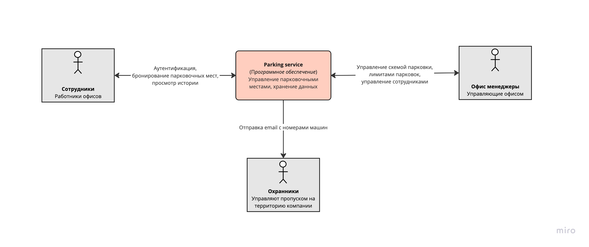
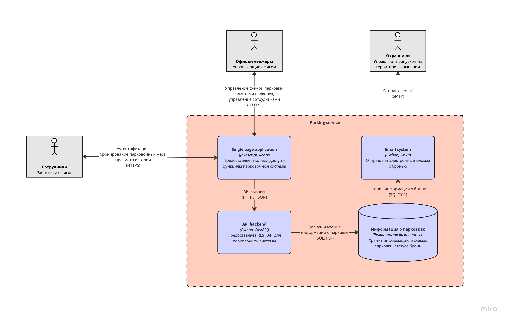
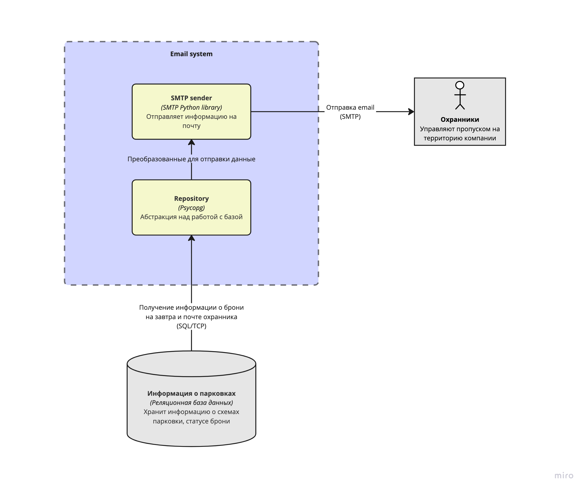
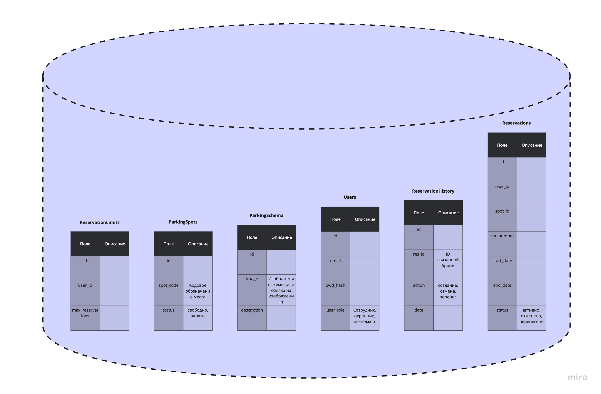

# Диаграммы C4 модели проекта "Система бронирования парковки"

---

## Диаграмма контекста

Основное взаимодействие происходит с сотрудниками офиса, охранниками и менеджерами.

## Диаграмма уровня контейнеров

Взаимодействие сотрудников и менеджеров происходит через single page application на react. Офис менеджеры вручную
добавляют и удаляют сотрудников. Также они загружают в систему схему парковочных мест и контролируют лимиты брони.

Сотрудники офиса могут бронировать парковочные места, а также отменять бронь и просматривать историю. Аутентификация в
системе происходит по выданным офис менеджером логинам и паролям.

## Компонентная диаграмма уведомлений

Ежедневно, по окончании текущего дня, осуществляется отправка одного письма, адресованного на завтра. Письмо
отправляется сотрудникам с ролью "Охранник", содержит номера машин, которые нужно пропустить на парковку на следующий
день.

Первая версия будет реализована на SMTP и запускаться по CRON. В дальнейшем планируется перейти на более надежный и
удобный сервис.

## Основные таблицы базы данных

В данный момент схема рассчитана на использование одной компанией. Для более масштабного распространения необходимо
добавить таблицу компаний и связать ее с таблицами сотрудников и парковочных мест.

Хранение визуального представления парковки находится на этапе проработки.

