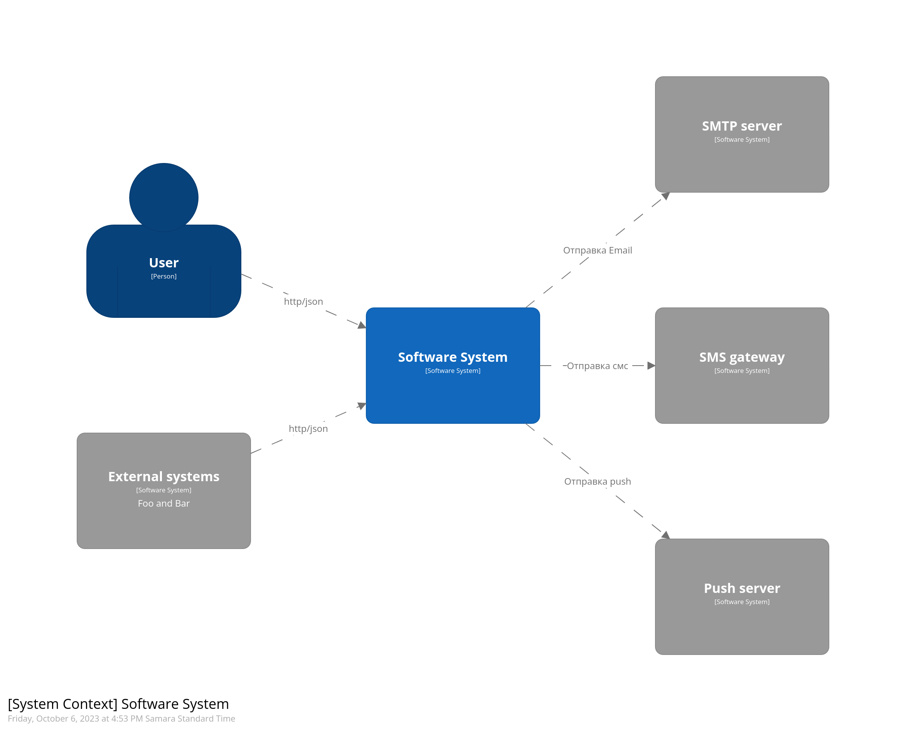
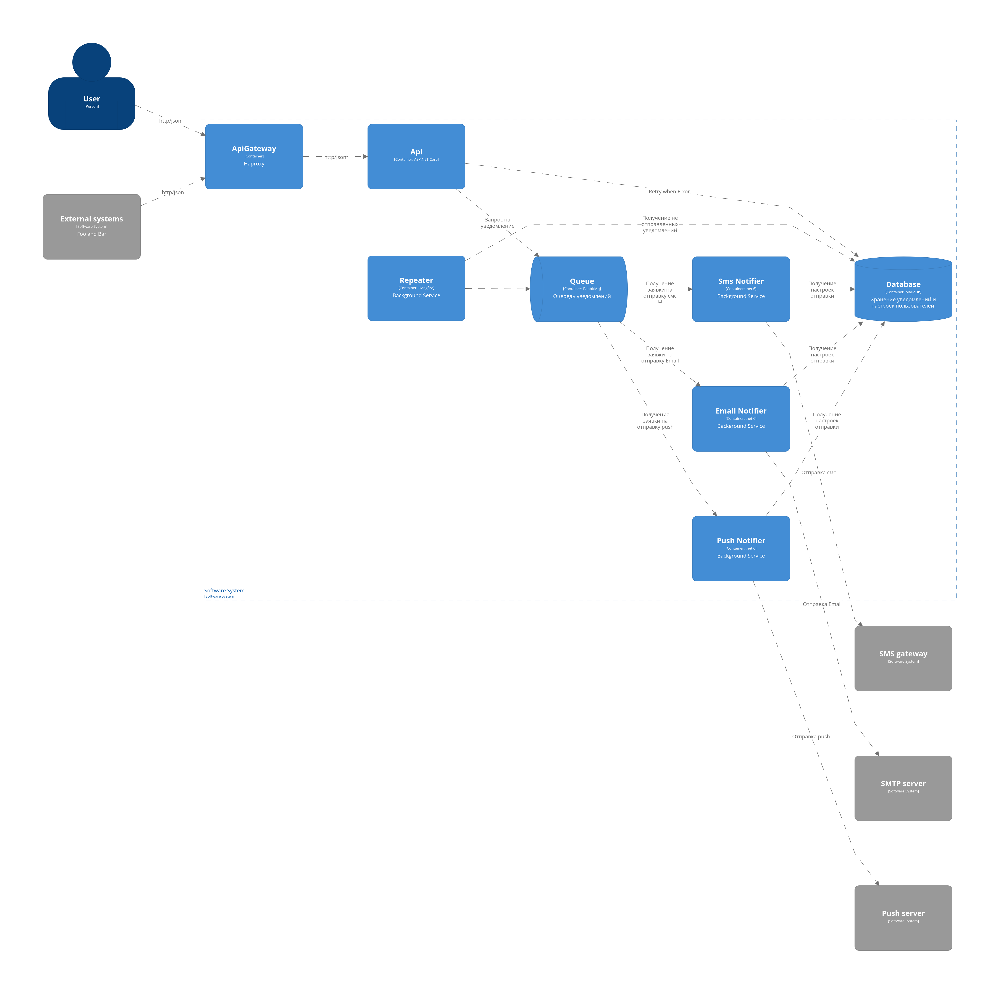
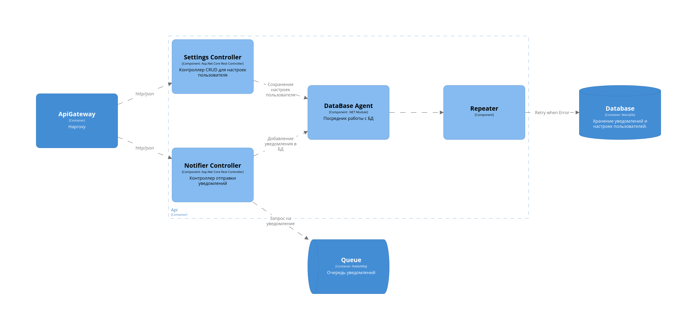
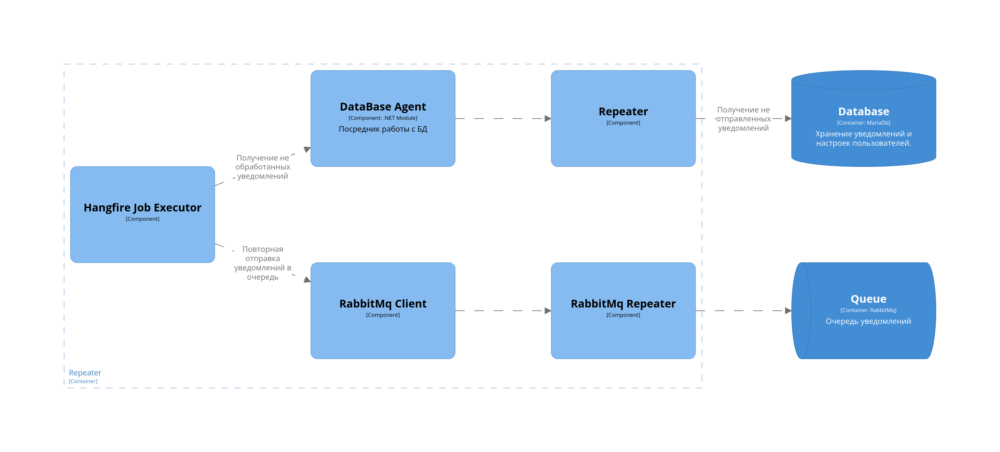
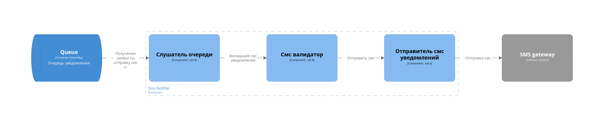
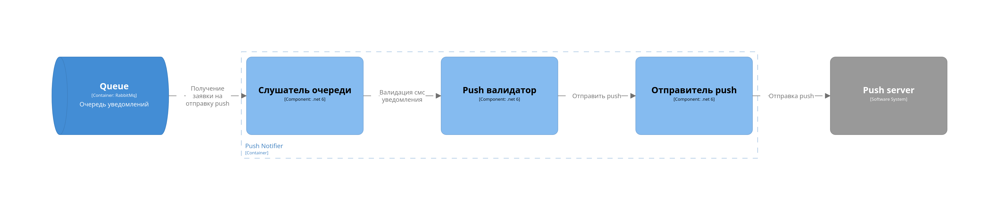

# Технический проект "Сервис отправки оповещений"

---

## Текущая архитектура

В текущей архитектуре у нас есть мобильное приложение, которое общается с компонентом "Controller", а он в свою очередь делает запросы к "Foo" и "Bar".

## Целевая архитектура

## Диаграмма контекста (C1):

Предполагается, что любой из существующих компонентов может отправить оповещение пользователю. При этом существующие каналы связи и предпочтения по их использованию известны системе оповещений, компоненты остальной системы знать это не должны.

## Диаграмма контейнеров (C2):

### Таблица ADL для схемы C2

|          Id           |    Дата    | Статус  | Участники      | Решения                                                                                 | 
|:---------------------:|:----------:|:-------:|----------------|-----------------------------------------------------------------------------------------|
| [ADR-1](ADR/ADR-1.md) | 05.10.2023 | Принято | Царьков Сергей | Выделение отдельного компонента для взаимодействия с пользователем и внешними системами | 
| [ADR-2](ADR/ADR-2.md) | 05.10.2023 | Принято | Царьков Сергей | Введение очереди поддерживающей маршрутизацию внутри себя                               |
| [ADR-3](ADR/ADR-3.md) | 05.10.2023 | Принято | Царьков Сергей | Введение реляционного хранилища для настроек пользователя и уведомлений                 |
| [ADR-4](ADR/ADR-4.md) | 05.10.2023 | Принято | Царьков Сергей | Введение фоновой службы для повторной отправки уведомления в очередь                    |
| [ADR-5](ADR/ADR-5.md) | 05.10.2023 | Принято | Царьков Сергей | Разделение контейнеров уведомителей на отдельные каналы связи                           |

## Диаграммы компонентов (C3)

### Диаграммы компонентов API:

### Диаграммы компонентов Repeater:

### Диаграммы компонентов SMS:

### Диаграммы компонентов Push:

### Диаграммы компонентов Email:

### Таблица ADL для схем C3

|          Id           |    Дата    | Статус  | Участники      | Решения                                                    | 
|:---------------------:|:----------:|:-------:|----------------|------------------------------------------------------------|
| [ADR-6](ADR/ADR-6.md) | 06.10.2023 | Принято | Царьков Сергей | Основной стек кодовой базы - .net 6                        | 
| [ADR-7](ADR/ADR-7.md) | 06.10.2023 | Принято | Царьков Сергей | Внедрение компонентов повтора отправки уведомлений в шлюзы |

#### Статус
| Название   | Комментарий                                       |
|------------|---------------------------------------------------|
| Предложено | Решение предложено. Находится на рассмотрении.    |
| Принято    | Решение рассмотрено и принято к исполнению.       |
| Отклонено  | Решение рассмотрено и отклонено.                  |
| Заменено   | Решение заменено иным.                            |
| Устарело   | Решение устарело, идет работа над новым решением. |
