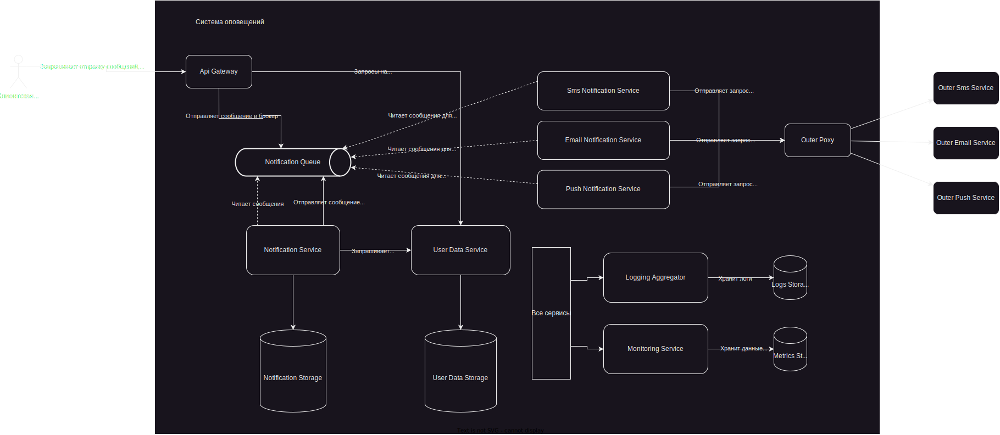
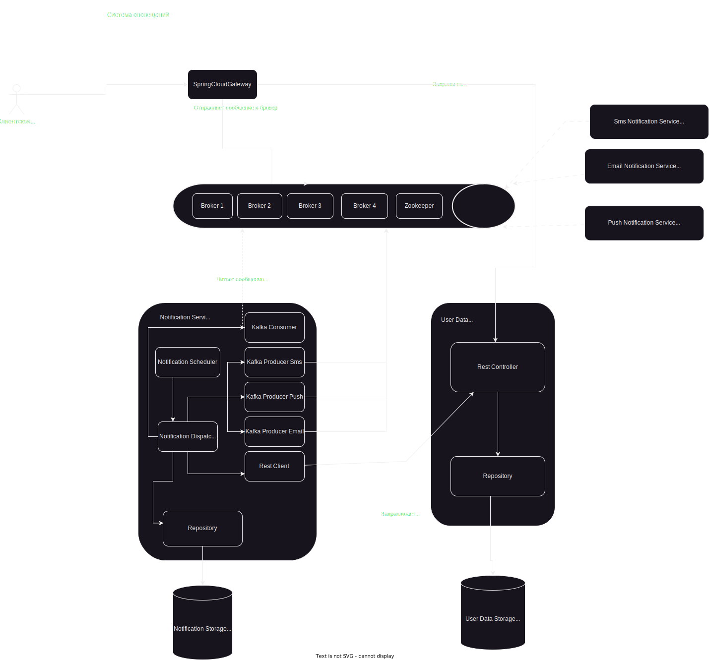

# Технический проект "Сервис отправки оповещений"

> Это фрагмент Технического проекта, который нужно заполнить в рамках практического задания темы "Технический проект".
---
## Целевая архитектура

### Диаграмма контекста (C1):

Предполагается, что любой из существующих компонентов может отправить оповещение пользователю. При этом существующие каналы связи и предпочтения по их использованию известны системе оповещений, компоненты остальной системы знать это не должны.

### Диаграмма контекста (C2):

Во время создания данной архитектуры были приняты следующие решения:

| ID       | Дата       | Статус      | Участники        |
|----------|------------|-------------|------------------|
| ADR-0001 | 08.10.2023 | Предложено  | Емельянов Денис  |
| ADR-0002 | 08.10.2023 | Предложено  | Емельянов Денис  |
| ADR-0003 | 09.10.2023 | Предложено  | Емельянов Денис  |
| ADR-0004 | 10.10.2023 | Предложено  | Емельянов Денис  |
| ADR-0005 | 10.10.2023 | Предложено  | Емельянов Денис  |
| ADR-0006 | 10.10.2023 | Предложено  | Емельянов Денис  |
| ADR-0007 | 10.10.2023 | Предложено  | Емельянов Денис  |
| ADR-0008 | 11.10.2023 | Предложено  | Емельянов Денис  |

В решении были использованы следующие контейнеры:
* API Gateway - открытый API шлюз
* Notification Service - сервис обработки уведомлений;
* User Data Service - сервис управления пользовательскими данными;
* SMS Notification Service - служба для отправки СМС
* Push Notification Service - служба для отправки Push-уведомлений;
* Email Notification Service - служба для отправки email;
* Notification Queue - очередь сообщений;
* Outer Proxy - прокси сервер для взаимодействия с внешними системами;
* Logging Aggregator - сервис работы с логами;
* Monitoring Service - сервис работы с метриками;
* Notification Storage - хранилище отправленных сообщений;
* User Data Storage - хранилище пользовательских данных;

### Диаграмма компонентов (С3)

Во время создания данной архитектуры были приняты следующие решения:

| ID       | Дата       | Статус      | Участники        |
|----------|------------|-------------|------------------|
| ADR-0009 | 12.10.2023 | Предложено  | Емельянов Денис  |
| ADR-0010 | 12.10.2023 | Предложено  | Емельянов Денис  |
| ADR-0011 | 13.10.2023 | Предложено  | Емельянов Денис  |
| ADR-0012 | 13.10.2023 | Предложено  | Емельянов Денис  |
| ADR-0013 | 13.10.2023 | Предложено  | Емельянов Денис  |
| ADR-0014 | 14.10.2023 | Предложено  | Емельянов Денис  |
| ADR-0015 | 14.10.2023 | Предложено  | Емельянов Денис  |

### Диаграмма компонентов Notification Service
