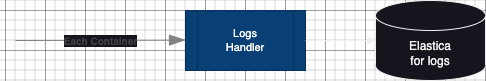
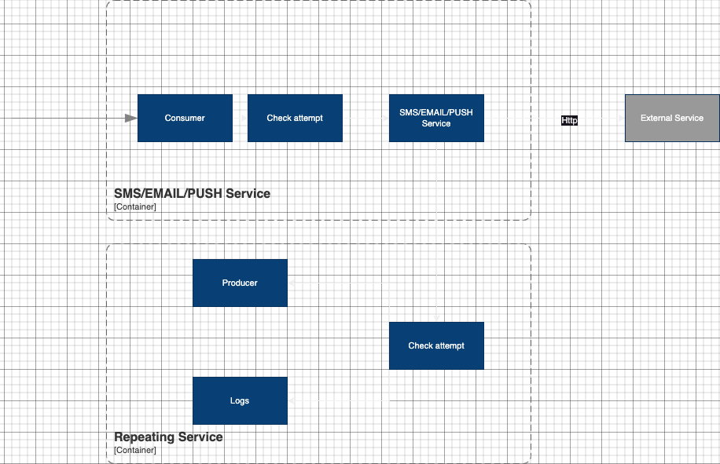

# Технический проект "Сервис отправки оповещений"

> Это фрагмент Технического проекта, который нужно заполнить в рамках практического задания темы "Технический проект".
---

## Текущая архитектура

В текущей архитектуре у нас есть мобильное приложение, которое общается с компонентом "Controller", а он в свою очередь делает запросы к "Foo" и "Bar".

## Целевая архитектура

### Диаграмма контекста (C1):

Предполагается, что любой из существующих компонентов может отправить оповещение пользователю. При этом существующие каналы связи и предпочтения по их использованию известны системе оповещений, компоненты остальной системы знать это не должны.

### Диаграмма контейнеров (C2):

Процессы:
   1. Запроса на формирование нотификейшена
   2. Сохранения информации об отправленных запросах
   3. Поддержка неотправленных запросов
   4. Рассылки оповещений по расписанию
   5. Формирование запроса
   6. Сбор данных (логи/метрики)

Бизнес-данные:    
   1. Конфигурации каналов связи
   2. Расписание рассылки

Отчетные/аналитические данные:
   1. Логи/Метрики

#### ADR:

| ID      | Дата       | Статус      | Участники     | Решения                                         |
|---------|------------|-------------|---------------|-------------------------------------------------|
| ADR-001 | 2023-10-08 | Рассмотрено | Трошина Дарья | Использовать REST API   Использование proxy |
| ADR-002 | 2023-10-08 | Рассмотрено | Трошина Дарья | Использовать API Gateway                        |
| ADR-004 | 2023-10-08 | Рассмотрено | Трошина Дарья | Использовать брокер сообщений для отправки оповещений на хэндлеры                                              |
| ADR-005 | 2023-10-08 | Рассмотрено | Трошина Дарья | Использования сервиса повторной отправки при сбоях                                              |
| ADR-007 | 2023-10-08 | Рассмотрено | Трошина Дарья | Логгирование для всех контейнеров                                            |

### Диаграмма компонентов (C3):

#### Компоненты Api GateWay + Notification handler:

| ID      | Дата       | Статус      | Участники     | Решения                                         |
|---------|------------|-------------|---------------|-------------------------------------------------|
| ADR-003 | 2023-10-08 | Рассмотрено | Трошина Дарья | Использовать PostgreSql                         |

#### Компоненты SMS/EMAIL/Push Handler, Repeating Handler, Logging:

| ID      | Дата       | Статус      | Участники     | Решения                                         |
|---------|------------|-------------|---------------|-------------------------------------------------|
| ADR-007 | 2023-10-08 | Рассмотрено | Трошина Дарья | Логгирование для всех контейнеров                         |
| ADR-008 | 2023-10-08 | Рассмотрено | Трошина Дарья | Сохранения недошедших сообщений в логи с ограниченным временем хранения                        |

Отдельной диаграммы для логов нет, так как было выбрано коробочное решение Graylog