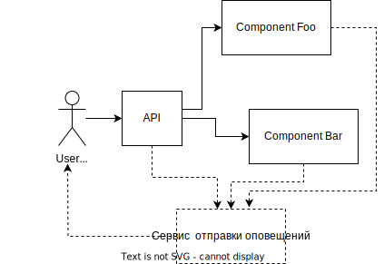

# Технический проект "Сервис отправки оповещений"

> Это фрагмент Технического проекта, который нужно заполнить в рамках практического задания темы "Технический проект".
---

## Текущая архитектура

В текущей архитектуре у нас есть мобильное приложение, которое общается с компонентом "Controller", а он в свою очередь делает запросы к "Foo" и "Bar".

## Целевая архитектура

### Диаграмма контекста (C1):

Предполагается, что любой из существующих компонентов может отправить оповещение пользователю. При этом существующие каналы связи и предпочтения по их использованию известны системе оповещений, компоненты остальной системы знать это не должны.

### Диаграмма контекста (C2):
> Вам нужно добавить C2 и C3 диграммы системы. Если при переходе от уровня к уровню были приняты архитектурно-значимые решения (выбор технологии для хранилища, дополнительные дизайн-паттерны и тд.) нужно добавить ссылки на соответствующие ADR.
