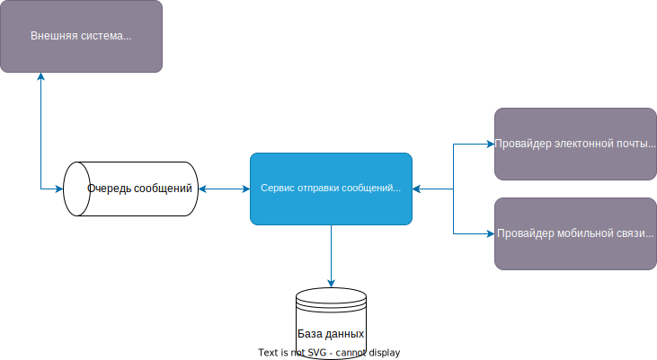

# Технический проект "Сервис отправки оповещений"

> Это фрагмент Технического проекта, который нужно заполнить в рамках практического задания темы "Технический проект".
---

## Текущая архитектура

В текущей архитектуре у нас есть мобильное приложение, которое общается с компонентом "Controller", а он в свою очередь делает запросы к "Foo" и "Bar".

## Перечень докумкентов ADR
| ID | Дата | Статус | Участники | Решения |
| --- | --- | --- | --- | --- |
| [ADR-001](static/adr1.md) | 16.10.2023 | Принято | Александр Кошелев | Использование сервиса очередей в проекте для взаимодействия между внешними системами и сервисом оповещения |
| [ADR-002](static/adr2.md) | 16.10.2023 | Принято | Александр Кошелев | Использование в проекте СУБД |
| [ADR-003](static/adr3.md) | 17.10.2023 | Принято | Александр Кошелев | Реализация сервиса очередей RabbitMQ |
| [ADR-004](static/adr4.md) | 17.10.2023 | Принято | Александр Кошелев | Реализация СУБД PostgreSQL |

## Целевая архитектура

### Диаграмма контекста (C1):

### Диаграмма контейнеров (C2):

### Диаграмма компонентов (C3):	
																							