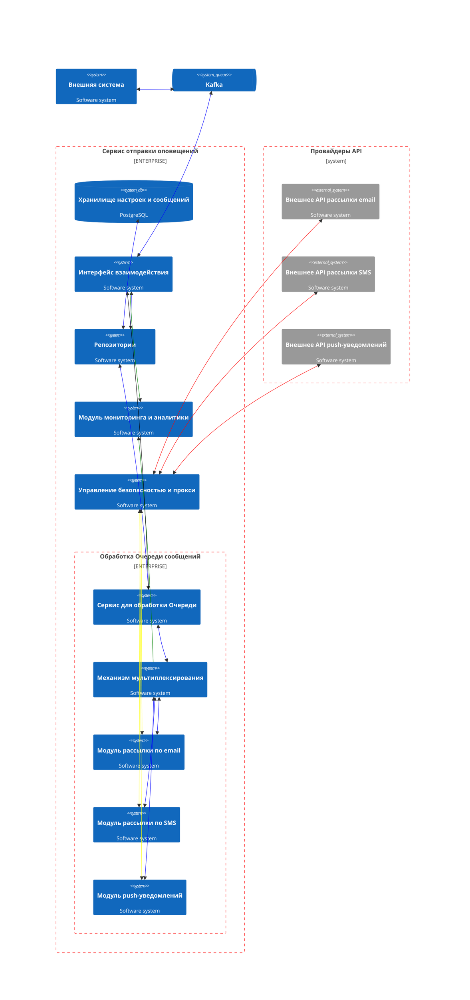
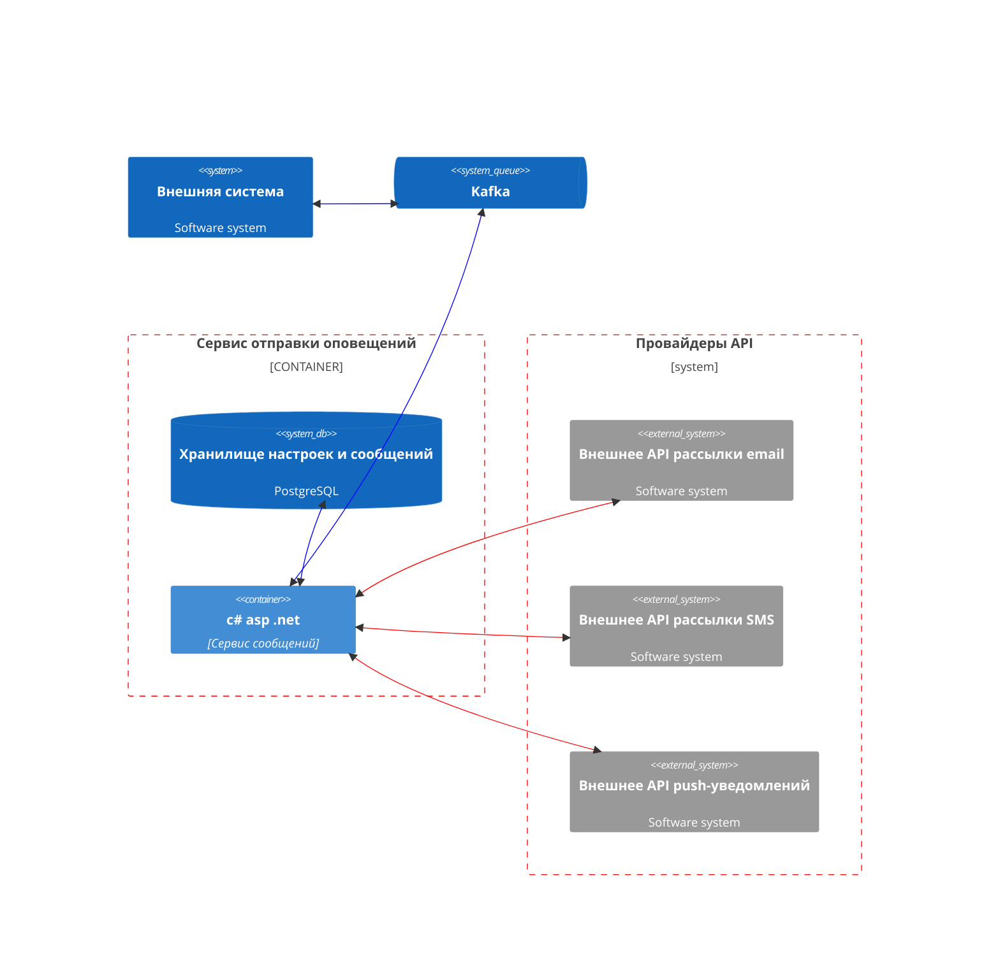
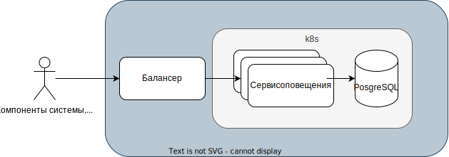
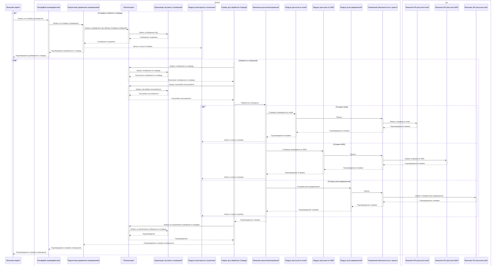

# Технический проект "Сервис отправки оповещений"

**Архитектор**: Евгений Климов / Название организации  
**Дата:** 10 октября 2023

### История версий

|    Дата    |     Автор      | Что изменилось                                   |
|:----------:|:--------------:|:-------------------------------------------------|
| 10.10.2023 | Евгений Климов | Создан документ, название и краткий обзор        |
| 10.10.2023 | Евгений Климов | Дополнена цель и ключевые особенности            |
| 10.10.2023 | Евгений Климов | Ключевые термины, определения, аббревиатуры      |
| 10.10.2023 | Евгений Климов | Границы проекта                                  |
| 10.10.2023 | Евгений Климов | Требования: Функциональные, Нефункциональные     |
| 10.10.2023 | Евгений Климов | Ограничения, Предложения                         |
| 11.10.2023 | Евгений Климов | Краткий обзор, Цель, Ключевые особенности        |
| 11.10.2023 | Евгений Климов | Границы проекта                                  |
| 11.10.2023 | Евгений Климов | Ключевые термины, определения, аббревиатуры      |
| 11.10.2023 | Евгений Климов | Текущая архитектура, Целевая архитектура         |
| 12.10.2023 | Евгений Климов | Создание ADR таблицы                             |
| 12.10.2023 | Евгений Климов | ADR-001                                          |
| 12.10.2023 | Евгений Климов | ADR-002                                          |
| 12.10.2023 | Евгений Климов | ADR-003                                          |
| 12.10.2023 | Евгений Климов | ADR-004                                          |
| 12.10.2023 | Евгений Климов | ADR-005                                          |
| 12.10.2023 | Евгений Климов | ADR-006                                          |
| 12.10.2023 | Евгений Климов | ADR-007                                          |
| 12.10.2023 | Евгений Климов | ADR-008                                          |
| 12.10.2023 | Евгений Климов | ADR-009                                          |
| 12.10.2023 | Евгений Климов | ADR-010                                          |
| 13.10.2023 | Евгений Климов | Переработаны требования                          |
| 13.10.2023 | Евгений Климов | ADR таблица вынесена в ADL                       |
| 13.10.2023 | Евгений Климов | Обзор                                            |
| 13.10.2023 | Евгений Климов | Функциональное Представление                     |
| 13.10.2023 | Евгений Климов | Полная диаграмма последовательности              |
| 13.10.2023 | Евгений Климов | Диаграмма контекста (C2)                         |
| 13.10.2023 | Евгений Климов | Актуализация: Функциональное Представление       |
| 13.10.2023 | Евгений Климов | Диаграмма развертывания                          |
| 16.10.2023 | Евгений Климов | Актуализация полной диаграммы последовательности |
| 16.10.2023 | Евгений Климов | Актуализация: Функциональное Представление       |
| 16.10.2023 | Евгений Климов | Описание процессов                               |
| 17.10.2023 | Евгений Климов | Дополнено описание ADR в Обзор                   |
| 17.10.2023 | Евгений Климов | Обновлена Диаграмма контекста                    |
| 17.10.2023 | Евгений Климов | Обновлена диаграмма последовательности           |
| 17.10.2023 | Евгений Климов | Диаграмма контейнеров                            |
| 17.10.2023 | Евгений Климов | Поправил диаграммы                               |

### Краткий обзор

##### Название проекта: Сервис отправки оповещений

Система отправки оповещений - ключевая часть нашей инфраструктуры, предназначенная для обеспечения эффективной рассылки оповещений о событиях нашим пользователям и клиентам. Эта подсистема обеспечивает возможность отправки оповещений через три основных канала связи: email, SMS и push-уведомления для мобильных устройств.

##### Цель
Целью проекта является создание надежной и гибкой подсистемы отправки оповещений для обеспечения своевременного и персонализированного информирования пользователей и клиентов системы о важных событиях. Основной акцент делается на:
- Многоканальности: Гарантируется, что каждый пользователь получит уведомление в предпочтительном для него канале связи.
- Персонализации: Каждый пользователь может настроить, какие оповещения он хочет получать, а также указать контактные данные, необходимые для доставки.
- Надежности: Обеспечивается надежность и гарантия доставки оповещений, даже в случае временных проблем с сетью.
- Масштабируемости: Система разрабатывается с учетом возможности масштабирования, чтобы справиться с увеличением числа пользователей и объема оповещений.

##### КЛЮЧЕВЫЕ ОСОБЕННОСТИ
- ***Многоканальность:*** Подсистема предоставляет возможность отправки оповещений через три различных канала связи: email, SMS и push-уведомления для мобильных устройств. Это обеспечивает максимальное охватывание аудитории и учет индивидуальных предпочтений пользователей.
- ***Персонализация:*** Каждый пользователь может настроить, какие оповещения он хочет получать, а также указать контактные данные, необходимые для доставки. Это повышает комфорт и релевантность оповещений для каждого получателя.
- ***Надежность:*** Гарантируется доставка оповещений с использованием устойчивых механизмов и повторной попытки в случае неудачной отправки. Это обеспечивает надежность и уверенность в доставке важных сообщений.
- ***Управление очередью:*** Система обеспечивает управление и приоритизацию оповещений в очереди, чтобы обеспечить равномерную и эффективную рассылку.
- ***Аналитика и мониторинг:*** Подсистема предоставляет инструменты для отслеживания статуса отправленных оповещений и анализа эффективности рассылки. Это позволяет оптимизировать процессы и повышать качество обслуживания.
- ***Масштабируемость:*** Разрабатываемая система спроектирована с учетом возможности горизонтального масштабирования. Это позволит поддерживать рост числа пользователей и объема оповещений.
- ***Безопасность:*** Обеспечивается шифрование данных и защита конфиденциальной информации пользователей. Это гарантирует сохранность данных и соблюдение стандартов безопасности.
- ***Прокси и защита:*** Система взаимодействует с внешними сервисами через прокси или другие механизмы защиты, обеспечивая безопасность и надежность операций.

Все это делает нашу систему отправки оповещений не только важным инструментом для укрепления нашей позиции на рынке, но и надежным средством для обеспечения информирования и обслуживания наших клиентов и пользователей.

### Введение

### Ключевые термины, определения, аббревиатуры

| Термин                                  | Определение                                                                                                                                                                                                                                                                              |
|:----------------------------------------|:-----------------------------------------------------------------------------------------------------------------------------------------------------------------------------------------------------------------------------------------------------------------------------------------|
| СУБД                                    | Система управления базами данных - это программное обеспечение, предназначенное для создания, управления и обслуживания баз данных, используемых для хранения и организации структурированной информации.                                                                                |
| SMS                                     | Short Message Service (сервис коротких сообщений) - это технология для отправки и получения текстовых сообщений, содержащих до 160 символов, на мобильные устройства.                                                                                                                    |
| Push-уведомления                        | Уведомления, отправляемые на мобильные устройства через специализированные приложения, обычно в режиме реального времени.                                                                                                                                                                |
| Электронная почта                       | Электронная почта (email) - это система электронной переписки через интернет, позволяющая отправлять и получать текстовые сообщения и файлы между пользователями с использованием уникальных адресов электронной почты.                                                                  |
| Многоканальность                        | Возможность отправки оповещений через несколько различных каналов связи для достижения максимального охвата аудитории.                                                                                                                                                                   |
| Персонализация                          | Процесс учета настроек пользователя для каждого канала связи, включая параметры включения/выключения, адрес электронной почты, номер телефона или логин для push-уведомлений.                                                                                                            |
| Шаблоны сообщений                       | Возможность создания и использования предварительно определенных шаблонов сообщений для различных видов событий.                                                                                                                                                                         |
| Управление очередью                     | Механизм, обеспечивающий управление и приоритизацию оповещений в очереди, обеспечивая равномерную нагрузку на систему.                                                                                                                                                                   |
| Масштабируемость                        | Разработка системы с учетом возможного роста числа пользователей и увеличения объема оповещений в будущем.                                                                                                                                                                               |
| API (Application Programming Interface) | Интерфейс программирования приложений - это набор правил и протоколов, позволяющих разным программам взаимодействовать между собой.                                                                                                                                                      |
| Email-гейты                             | Email-гейты представляют собой компоненты системы, ответственные за маршрутизацию и обработку электронных писем. Они осуществляют взаимодействие с внешними почтовыми серверами и обеспечивают передачу электронных оповещений, а также следят за состоянием доставки и обратной связью. |
| Деплой системы                          | Процесс размещения и настройки всех компонентов и ресурсов системы в целевой среде, где она будет функционировать. Он включает в себя установку и настройку программного обеспечения, баз данных, настройку сетей, а также запуск и проверку работоспособности системы.                  |

### Границы проекта
##### Включено:
- Разработка и реализация подсистемы отправки оповещений для трех каналов связи: email, SMS и push-уведомления для мобильных устройств.
- Создание механизма настройки оповещений для конечных пользователей, позволяющего им управлять настройками для каждого канала связи (включение/выключение, адрес электронной почты, номер телефона или логин для push-уведомлений).
- Гарантия доставки оповещений с использованием устойчивых механизмов и повторной попытки в случае неудачной отправки.
- Управление очередью оповещений для обеспечения равномерной нагрузки на систему.
- Внедрение аналитики и мониторинга для отслеживания статуса отправленных оповещений и анализа эффективности рассылки.
- Разработка с учетом будущего роста числа пользователей и увеличения объема оповещений.

##### Исключено:
- Возможность создания и использования шаблонов сообщений для различных видов событий.
- Проектирование внешних смс и email-гейтов, а также решение всех вопросов, связанных с внешними системами, так как основное направление проекта - отправка оповещений, и не включает в себя функции, выходящие за его рамки.
- Прямой доступ внешних систем к смс-рассылке без использования прокси или защитных механизмов, так как наша система обеспечивает безопасность и надежность операций через соответствующие механизмы.
- Взаимодействие внешних систем с нашей базой данных, так как внешние системы не пишут в нашу базу данных.
- Любые дополнительные функции, не связанные непосредственно с целью проекта, и не оговоренные включенными пунктами в границах проекта.

### Требования
#### Заинтересованные стороны
|      Сторона       |      Имя       | Роль/Должность | Интересы/Опасения                             |
|:------------------:|:--------------:|:--------------:|:----------------------------------------------|
| Инженерная команда | Евгений Климов |   Архитектор   | Согласованные и подробно описанные требования |

#### Функциональные требования
| Группа                      |   ID   | Описание                                                                                                                                            | Приоритет |
|:----------------------------|:------:|:----------------------------------------------------------------------------------------------------------------------------------------------------|:---------:|
| Рассылка оповещений         | FR-001 | Отправка оповещений по email                                                                                                                        |  Высокий  |
| Рассылка оповещений         | FR-002 | Отправка оповещений по SMS                                                                                                                          |  Высокий  |
| Рассылка оповещений         | FR-003 | Отправка оповещений через push-уведомления                                                                                                          |  Высокий  |
| Управление настройками      | FR-004 | Возможность конечных пользователей управлять настройками оповещений для каждого канала связи (вкл./выкл., адрес, номер, логин для push-уведомлений) |  Средний  |
| Механизм повторной отправки | FR-005 | Механизм повторной отправки оповещений при неудачной доставке                                                                                       |  Средний  |
| Управление очередью         | FR-006 | Управление и приоритизация оповещений в очереди                                                                                                     |  Средний  |
| Аналитика и мониторинг      | FR-007 | Внедрение аналитики и мониторинга для отслеживания статуса отправленных оповещений и анализа эффективности рассылки                                 |  Средний  |

#### Нефункциональные требования
| Группа             |   ID    | Описание                                                                                                         | Приоритет |
|:-------------------|:-------:|:-----------------------------------------------------------------------------------------------------------------|:---------:|
| Производительность | NFR-001 | Время реакции системы для 95% действий пользователей, включая отправку оповещений, не должно превышать 2 секунды |  Высокий  |
| Безопасность       | NFR-002 | Обеспечение шифрования данных и защиты конфиденциальной информации пользователей при передаче и хранении         |  Высокий  |
| Масштабируемость   | NFR-003 | Система должна быть способной масштабироваться для обслуживания роста числа пользователей и объема оповещений    |  Высокий  |

## Ограничения

|     Тип     |  ID   | Описание                                                                                                                                                                                                         |
|:-----------:|:-----:|:-----------------------------------------------------------------------------------------------------------------------------------------------------------------------------------------------------------------|
| Техническое | C-001 | Система оповещений должна обеспечивать горизонтальное масштабирование для обработки увеличения нагрузки путем добавления дополнительных узлов через балансировщик нагрузки.                                      |
| Техническое | C-002 | Система должна иметь защиту от прямого доступа внешних систем к функциональности SMS-рассылки и электронной почты. Все запросы от внешних систем должны осуществляться через прокси или другой механизм защиты.  |
| Техническое | C-003 | Система оповещений не должна взаимодействовать напрямую с базой данных внешних систем. Взаимодействие с внешними системами должно осуществляться только через определенные интерфейсы и API.                     |
| Техническое | C-004 | Система оповещений не должна пытаться решать задачи внешних систем или проектировать внешние смс и email-гейты. Ее функциональность ограничивается отправкой оповещений и учетом предпочтений для каналов связи. |
| Техническое | C-005 | Система должна иметь механизм хранимых сообщений с гарантией доставки (опционально) и обеспечивать корректное восстановление после отключения внешнего интернет-соединения.                                      |

#### Предположения

|  ID   | Описание                                                                                                                                                      |
|:-----:|:--------------------------------------------------------------------------------------------------------------------------------------------------------------|
| A-001 | Оповещения будут исходить только из существующих компонентов системы, таких как "Controller", "Foo" и "Bar".                                                  |
| A-002 | Система оповещений знает о наличии и настройках каналов связи (email, SMS, push-уведомления), и эта информация не зависит от остальных компонентов системы.   |
| A-003 | Настройки пользователей по каналам связи (вкл./выкл., адрес/номер/логин) будут применяться в соответствии с их предпочтениями при рассылке оповещений.        |
| A-004 | Ожидается, что пользователи будут активно использовать возможности настройки каналов связи и включения/выключения оповещений.                                 |
| A-005 | Система оповещений предназначена исключительно для внутреннего использования в рамках системы и не будет предоставляться внешним сторонам.                    |
| A-006 | Предполагается, что существующие компоненты системы будут предоставлять все необходимые данные и события для отправки оповещений.                             |
| A-007 | Все компоненты системы обладают достаточной производительностью и доступностью для обеспечения оперативной отправки оповещений.                               |
| A-008 | Сторонние API и сервисы, необходимые для отправки оповещений (например, почтовые серверы, SMS-шлюзы), будут доступны и функциональны в течение всего проекта. |

## Текущая архитектура

В текущей архитектуре у нас есть мобильное приложение, которое общается с компонентом "Controller", а он в свою очередь делает запросы к "Foo" и "Bar".

## Целевая архитектура
### Диаграмма контекста (C1):

### Диаграмма контекста (C2):

### Диаграмма контейнеров (C2):

Предполагается, что любой из существующих компонентов может отправить оповещение пользователю. При этом существующие каналы связи и предпочтения по их использованию известны системе оповещений, компоненты остальной системы знать это не должны.

##### Обзор

Краткое резюме общей целевой архитектуры (Common Target Architecture, CTA) представляет собой высокоуровневую архитектурную концепцию, созданную для обеспечения базы и ориентира для более подробных архитектурных решений, которые будут представлены далее в рамках проекта. Проект также использует [ADL (Architectural Decision Log)](adl.md) для документирования ключевых архитектурных решений и обоснований.

* С выбором технологий, можно ознакомиться в [ADR-001 Выбор технологии для отправки оповещений](adrs/adr_001.md).
* С выбором хранилища пользовательских настроек и сообщений, можно ознакомиться в [ADR-017 Выбор хранилища для пользовательских настроек и сообщений](adrs/adr_017.md).
* С решением по реализации модуля механизма мультиплексирования, адресной отправки и особенностей разных каналов, можно ознакомиться в [ADR-018 Реализация механизма мультиплексирования, адресной отправки и обработки особенностей разных каналов связи](adrs/adr_003.md).
* С решением по интеграции внешних систем, можно ознакомиться в [ADR-005 Интеграция внешних систем](adrs/adr_005.md).
* С решением по отправки сообщений из очереди, можно ознакомиться в [ADR-019 Использование очередей и шаблона проектирования "Планировщик" для обработки оповещений](adrs/adr_019.md).
* С решением по обеспечению мониторинга, логирования и надежности системы оповещений, можно ознакомиться в [ADR-020 Обеспечение мониторинга, логирования и надежности системы оповещений](adrs/adr_020.md).
* С решением по сбору бизнес метрик, можно ознакомиться в [ADR-007 Бизнес метрики](adrs/adr_007.md).
* Подробнее об управлении безопасности и прокси, можно ознакомиться в [ADR-014 Управление безопасностью и прокси](adrs/adr_014.md).

##### Функциональное Представление
***Интерфейс взаимодействия:*** Этот компонент представляет собой точку входа для взаимодействия с остальными компонентами системы. Его основная задача - обеспечивать взаимодействие между внешними системами и подсистемой управления оповещениями. Он принимает запросы и передает их на обработку в подсистему управления оповещениями.

***Подсистема управления оповещениями:*** Обеспечивает отправку сообщений в очередь.

***Хранилище настроек и сообщений:*** Отвечает за хранение настроек пользователей, таких как контактные данные и предпочтения по типам оповещений. Так же хранит в себе очередь сообщений.

***Сервис для обработки Очереди:*** Этот компонент обеспечивает управление и обработку больших объемов оповещений. Он также гарантирует сохранность и доставку оповещений, даже в случае временных сбоев в системе.

***Механизм мультиплексирования и адресной отправки:*** Этот компонент занимается маршрутизацией оповещений к нужным каналам связи и адресатам, учитывая предпочтения пользователей.

***Модуль рассылки по email:*** Отвечает за отправку оповещений по email в соответствии с настройками и предпочтениями пользователей.

***Модуль рассылки по SMS:*** Этот модуль отправляет SMS-оповещения на номера телефонов, указанные в настройках пользователей.

***Модуль push-уведомлений для мобильных устройств:*** Отправляет push-уведомления на мобильные устройства в соответствии с настройками и предпочтениями пользователей.

***Модуль мониторинга и аналитики:*** Этот модуль отслеживает статус отправленных оповещений и собирает данные для анализа эффективности рассылки. Он также предоставляет инструменты для аналитики.

***Логирование и мониторинг:*** Компонент, ответственный за запись событий и мониторинг работы системы, включая производительность и доступность компонентов.

***Управление безопасностью и прокси:*** Обеспечивает безопасность при взаимодействии системы с внешними сервисами через прокси и другие механизмы защиты.

***Репозитории:*** Репозитории взаимодействия с хранилищем

##### Развертывание

* [ADR-016 Обеспечение масштабируемости и отказоустойчивости системы оповещений с использованием Kubernetes и контейнеризации](adrs/adr_016.md)

Для обеспечения масштабируемости и отказоустойчивости системы оповещений будет использоваться технология контейнеризации с оркестрацией в Kubernetes.

**Диаграмма развертывания:**

##### Процессы

Процессы описаны в диаграмме последовательности, без учета логирования.

**Полная диаграмма последовательности:**
