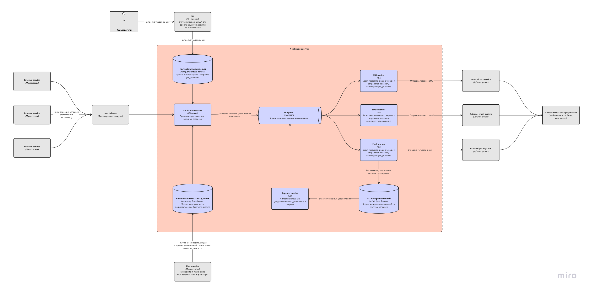

# Технический проект "Сервис отправки оповещений"

> Это фрагмент Технического проекта, который нужно заполнить в рамках практического задания темы "Технический проект".
---

## Текущая архитектура

В текущей архитектуре у нас есть мобильное приложение, которое общается с компонентом "Controller", а он в свою очередь делает запросы к "Foo" и "Bar".

## Целевая архитектура

После анализа требований было принято решение использование архитектуры микросервисов. 

### Диаграмма контекста (C1):

Предполагается, что любой из существующих компонентов может отправить оповещение пользователю. При этом существующие каналы связи и предпочтения по их использованию известны системе оповещений, компоненты остальной системы знать это не должны.

### Диаграмма контейнеров (C2):

Процессы:
   1. Запроса на формирование нотификейшена
   2. Сохранения информации об отправленных запросах
   3. Поддержка неотправленных запросов
   4. Рассылки оповещений по расписанию
   5. Формирование запроса
   6. Сбор данных (логи/метрики)

Бизнес-данные:    
   1. Конфигурации каналов связи

Отчетные/аналитические данные:
   1. Логи/Метрики

Были использованы следующие решения:
- Proxy для дополнительной защиты и возможности обработки ошибок
- API Gateway - микросервис, осуществляющий единую точку входа в сервис, балансировку нагрузки и валидацию запроса. 
- Notification service - сервис обработки сообщений
- SMS/EMAIL/Push Service - сервисы для валидации сообщений, и работы с отправкой SMS/EMAIL/Push. (3 отдельных) На этом уровне учитывается природу разных каналов связи, их потенциальные ограничения и пропускную способность (например, ограничение количества символов в СМС, стоимость СМС, лимиты пуш-очередей провайдеров, возможность попадания email в спам) 
- Repeating Service - сервис повторной отправки сообщения. В него попадают не отправленные, валидируется то, сколько было "попыток" доставить сообщение и после повторно отправляется в очередь. Количество попыток ограничено 
- Logging Service - логирование каждого контейнера
- Multiplexer - возможность отправлять групповые сообщения в один канал

Были использованы следующие базы данных:
- Postgresql для хранения персональных знания о юзерах в захэшированном виде. 
- Postgresql для хранения настроек отправляемых сообщений
- Query bd (RabbitMQ) - для взаимодействия между Notification service и SMS/EMAIL/Push Service. Разделен на три топика, по одному на канал 
- Graylog - Elastica, MongoDB

Более подробные обоснования каждого решения в ADR: 

#### ADR:

| ID      | Дата       | Статус      | Участники     | Решения                                        |
|---------|------------|-------------|---------------|------------------------------------------------|
| ADR-001 | 2023-10-08 | Рассмотрено | Трошина Дарья | Использовать REST API  |
| ADR-002 | 2023-10-08 | Рассмотрено | Трошина Дарья | Использовать API Gateway                       |
| ADR-004 | 2023-10-08 | Рассмотрено | Трошина Дарья | Использовать брокер сообщений для отправки оповещений на хэндлеры                                             |
| ADR-005 | 2023-10-08 | Рассмотрено | Трошина Дарья | Использования сервиса повторной отправки при сбоях                                             |
| ADR-007 | 2023-10-08 | Рассмотрено | Трошина Дарья | Логгирование для всех контейнеров                                           |
| ADR-009 | 2023-10-09 | Рассмотрено | Трошина Дарья | Использование proxy                                         |
| ADR-010 | 2023-10-14 | Рассмотрено | Трошина Дарья | Использование Multiplexer  |

### Диаграмма компонентов (C3):

#### Компоненты Api GateWay + Notification handler:

| ID      | Дата       | Статус      | Участники     | Решения                                         |
|---------|------------|-------------|---------------|-------------------------------------------------|
| ADR-003 | 2023-10-08 | Рассмотрено | Трошина Дарья | Использовать PostgreSql                         |

#### Компоненты SMS/EMAIL/Push Service, Repeating Service, Logging:

На этом уровне учитывается природу разных каналов связи, их потенциальные ограничения и пропускную способность (например, ограничение количества символов в СМС, стоимость СМС, лимиты пуш-очередей провайдеров, возможность попадания email в спам) 
благодаря разделению каналов отправки и добавления SMS/EMAIL/Push Service.

| ID      | Дата       | Статус      | Участники     | Решения                                         |
|---------|------------|-------------|---------------|-------------------------------------------------|
| ADR-007 | 2023-10-08 | Рассмотрено | Трошина Дарья | Логгирование для всех контейнеров                         |
| ADR-008 | 2023-10-08 | Рассмотрено | Трошина Дарья | Сохранения недошедших сообщений в логи с ограниченным временем хранения                        |

Отдельной диаграммы для логов нет, так как было выбрано коробочное решение Graylog

### Критерии оценки:
- **Соответствие требованиям.**:
  - реализация обособленной части системы для отправки оповещений о событиях по трем каналам связи SMS/EMAIL/Push
  - подсистема должна принимать от пользователя системы настройки по каждому каналу связи для рассылки уведомлений
  - взаимодействия с внешними для нашей системы подсистемами
  -  предусмотрена возможность мультиплексирования
  - учитывать природу разных каналов связи, их потенциальные ограничения и пропускную способность (например, ограничение количества символов в СМС, стоимость СМС, лимиты пуш-очередей провайдеров, возможность попадания email в спам
- **Устойчивость** Провести тестирование системы с различными кейсами. Система не должна зависать, терять данные. Также провести нагрузочное тестирование.
- **Производительность** Оценить проходимость сервиса для групповых и одиночных оповещений
- **Соответствие бюджету и сроку**:
  - оценить ресурсы требуемые на реализацию (время/деньги)
  - оценить количество ресурсов требуемых на поддержку и сопровождение  (время/деньги)