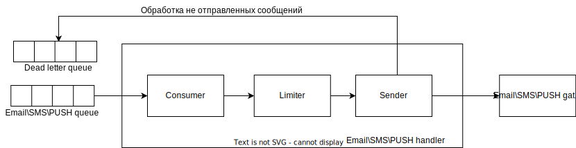

# Технический проект "Сервис отправки оповещений"

> Это фрагмент Технического проекта, который нужно заполнить в рамках практического задания темы "Технический проект".
---

## Текущая архитектура

В текущей архитектуре у нас есть мобильное приложение, которое общается с компонентом "Controller", а он в свою очередь делает запросы к "Foo" и "Bar".

## Целевая архитектура

### Диаграмма контекста (C1):

Предполагается, что любой из существующих компонентов может отправить оповещение пользователю. При этом существующие каналы связи и предпочтения по их использованию известны системе оповещений, компоненты остальной системы знать это не должны.

### Диаграмма контейнеров (C2):

#### ADL для диаграммы контейнеров:
| ID                        | Дата       | Статус     | Участники         | Решения                                                                                     | 
|---------------------------|------------|------------|-------------------|---------------------------------------------------------------------------------------------|
| [ADR-001](adr/adr-001.md) | 07.10.2023 | Принято    | Заказчик          | Использовать REST API для взаимодействия с сервисом отправки уведомлений и шлюзами отправки |
| [ADR-002](adr/adr-002.md) | 07.10.2023 | Принято    | Жмурко Константин | Использовать API Gateway для взаимодействия с пользователями                                |
| [ADR-003](adr/adr-003.md) | 07.10.2023 | Принято    | Жмурко Константин | Использовать брокер для доставки уведомлений обработчикам                                   |
| [ADR-004](adr/adr-004.md) | 07.10.2023 | Принято    | Жмурко Константин | Использовать реляционное хранилище для хранения настроек пользователей                      |
| [ADR-005](adr/adr-005.md) | 07.10.2023 | Заменено   | Жмурко Константин | Добавить компонент для повторной отправки неудачный уведомлений                             |
| [ADR-008](adr/adr-007.md) | 07.10.2023 | Принято | Жмурко Константин | Добавить компонент для обработки ограничений связанных с типом сообщения | 
| [ADR-009](adr/adr-008.md) | 07.10.2023 | Предложено | Жмурко Константин | Добавить компонент для обработки сообщений не доставленных после исчерпания повторных попыток |
| [ADR-010](adr/adr-010.md) | 10.10.2023 | Предложено | Жмурко Константин | Добавить компонент для повторной отправки неудачный уведомлений                             |

### Диаграммы компонетнов (C3)

#### Компонент Notification handler:

#### ADL для компонента Notification handler:
| ID                        | Дата       | Статус  | Участники         | Решения                                                                             | 
|---------------------------|------------|---------|-------------------|-------------------------------------------------------------------------------------|
| [ADR-006](adr/adr-005.md) | 07.10.2023 | Принято | Жмурко Константин | Использовать отдельные очереди для каналов связи                                    |
| [ADR-007](adr/adr-006.md) | 07.10.2023 | Принято | Жмурко Константин | Использовать отдельный слой для доступа к хранилищу данных настроек и пользователей |

#### Компоненты Email\SMS\PUSH handler:

