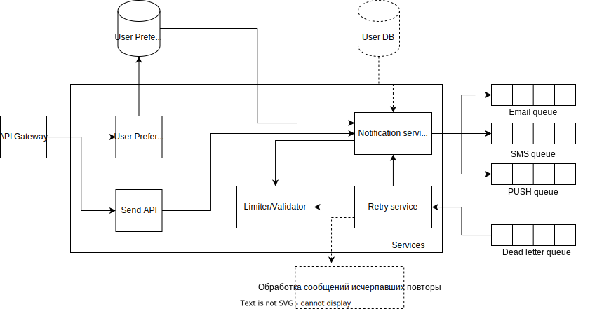

# Технический проект "Сервис отправки оповещений"

> Это фрагмент Технического проекта, который нужно заполнить в рамках практического задания темы "Технический проект".
---

## Текущая архитектура

В текущей архитектуре у нас есть мобильное приложение, которое общается с компонентом "Controller", а он в свою очередь делает запросы к "Foo" и "Bar".

## Целевая архитектура

### Диаграмма контекста (C1):

Предполагается, что любой из существующих компонентов может отправить оповещение пользователю. При этом существующие каналы связи и предпочтения по их использованию известны системе оповещений, компоненты остальной системы знать это не должны.

### Диаграмма контейнеров (C2):

В результате анализа представленного задания и пояснений из README.md были определены следующие процессы:
- Основные процессы:
    - Процесс принятия запроса на формирование рассылки.
    - Процесс сохранения параметров настройки по каждому каналу связи для рассылки уведомлений.
    - Процесс сохранения информации об отправленных запросах.
    - Процесс рассылки одиночного оповещения.
    - Процесс рассылки оповещений по заданному регламенту (с определенным периодом).
    - Процесс мультиплексирования оповещений и управления рассылкой.

- Процессы управления:
    - Процесс обслуживания входного соединения и обработки нештатных ситуаций (сетевые ошибки, задержки и т.п.).

- Процессы поддержки:
    - Процесс стыковки с сервисом отправки SMS.
    - Процесс стыковки с сервисом отправки EMail.
    - Процесс стыковки с сервисом отправки Push-уведомлений.
    - Процесс централизованного сбора логов.
    - Процесс централизованного сбора метрик.
    - Процесс централизованного сбора данных трассировки с компонент системы, которые стыкуются с внешними системами.

Определены следующие виды данных:
- Бизнес-данные:    
    - Настройки по каждому каналу связи для рассылки уведомлений.
    - Параметры рассылки уведомлений (регламентные рассылки).
    - Данные о уведомлениях, которые были отправлены (возможно этот пункт стоит отнести к "отчетным и аналитическим данным").

- Отчетные и аналитические данные.
    - Логи с компонент системы.
    - Метрики с компонент системы.
    - Результаты трассировки запросов.

Данная архитектура построена на основе следующих ADR:
| ID | Дата | Статус | Участники         | Решения             |
| --- | --- | --- |-------------------|---------------------|
| ADR-001 | 2023.10.07 | Предложено | Абдрахманов Марат |  |
| ADR-002 | 2023.10.07 | Предложено | Абдрахманов Марат |  |
| ADR-003 | 2023.10.07 | Предложено | Абдрахманов Марат |  |
| ADR-004 | 2023.10.07 | Предложено | Абдрахманов Марат |  |
| ADR-005 | 2023.10.07 | Предложено | Абдрахманов Марат |  |
| ADR-006 | 2023.10.07 | Предложено | Абдрахманов Марат |  |

В результате анализа представленных ADR были сделаны следующие заключения (гипотезы):
- Если количество данных в "БД хранения рассылок" станет слишком большим, то можно сделать шардирование БД.
- Если необходимо будет шардирование "БД хранения рассылок", то раздельное хранение настроек каналов и пользовательских данных от информации о рассылках упростит этот процесс.
- Если нагрузка на рассылку сильно возрастет, то можно сделать несколько экземпляров API Gateway, а перед ними поставить балансировщик.
- Если будут просадки по производительности, то сервисы трассировки и сбора метрик помогу в выяснения причины.

### Диаграмма компонент (C3):
Для детального представления внутреннего устройства контейнеров через компоненты и их связи построим несколько диаграмм компонентов.

Диаграмма компонентов API Gateway, Брокера и Notify Service:

Диаграмма компонент построена на основе следующих ADR:
| ID | Дата | Статус | Участники         | Решения             |
| --- | --- | --- |-------------------|---------------------|
| ADR-3001 | 2023.10.08 | Предложено | Абдрахманов Марат |  |

Диаграмма компонентов Multiplexer & Sender Service, SMS Gateway, Push-notify Gateway, EMail Gateway:

Диаграмма компонент построена на основе следующих ADR:
| ID | Дата | Статус | Участники         | Решения             |
| --- | --- | --- |-------------------|---------------------|
| ADR-3002 | 2023.10.08 | Предложено | Абдрахманов Марат |  |

Отдельная диаграмма компонентов для трассировки, сборки метрик и сохранения логов не приводится, т.к. они строятся на базе стандартных решений. Для централизованного сбора и хранения логов будет использоваться Graylog, который для работы дополнительно требует развернутый ElasticSearch, в качестве хранилища используется MongoDB (https://graylog.org/), для работы с метриками выберем Prometheus (https://prometheus.io/), а для хранения трейсов - Jager (https://www.jaegertracing.io/).