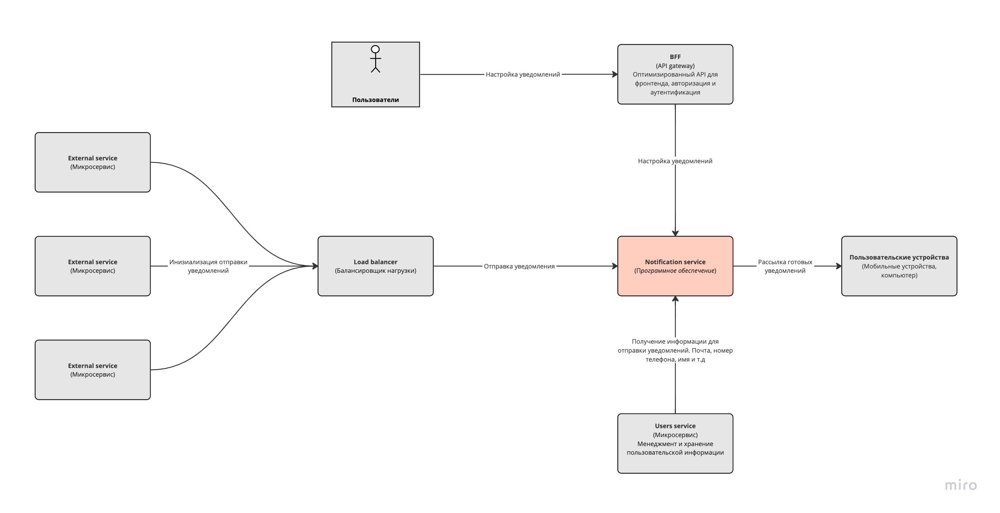
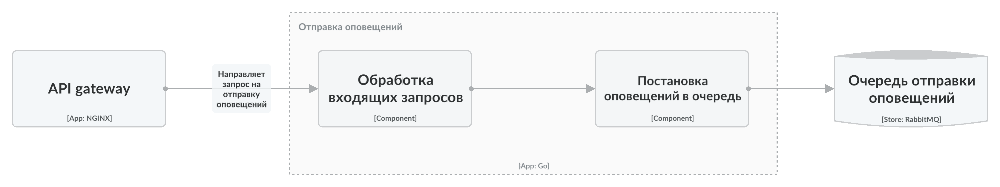

# Технический проект "Сервис отправки оповещений"

## Текущая архитектура

В текущей архитектуре у нас есть мобильное приложение, которое общается с компонентом "Controller", а он в свою очередь делает запросы к "Foo" и "Bar".

## Целевая архитектура

### Диаграмма контекста (C1):

### Диаграмма контекста (C2):

### Диаграмма контекста (C3):

### Список решений (ADL):

| ID |  Дата | Статус | Участники | Решения |
| --- | --- | --- | --- | --- |
| [ADR-001](https://github.com/a-gataullin/architect-practice-tpl/blob/main/notificator/static/ADR-001.md) | 13.10.2023 | Принято | Гатауллин Артур | Использовать Nginx для API gateway |
| [ADR-002](https://github.com/a-gataullin/architect-practice-tpl/blob/main/notificator/static/ADR-002.md) | 13.10.2023 | Принято | Гатауллин Артур | Использовать Rabbit MQ для очереди сообщений |
| [ADR-003](https://github.com/a-gataullin/architect-practice-tpl/blob/main/notificator/static/ADR-003.md) | 13.10.2023 | Принято | Гатауллин Артур | Использовать Postgresql для хранилища настроек пользователя |
