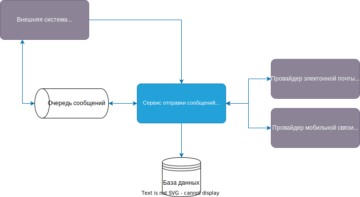

# Технический проект "Сервис отправки оповещений"

## Текущая архитектура

В текущей архитектуре у нас есть мобильное приложение, которое общается с компонентом "Controller", а он в свою очередь делает запросы к "Foo" и "Bar".

## Целевая архитектура

### Диаграмма контекста (C1):

Предполагается, что любой из существующих компонентов может отправить оповещение пользователю. При этом существующие каналы связи и предпочтения по их использованию известны системе оповещений, компоненты остальной системы знать это не должны.

### Диаграмма контекста (C2):

#### ADL С2:
| ID               | Дата       | Статус  | Участники         | Решения                                                               | 
|------------------|------------|---------|-------------------|-----------------------------------------------------------------------|
| [ADR-8](ADR8.md) | 08.10.2023 | Принято | Заказчик          | Использовать REST API для взаимодействия сервиса с внешними сервисами |
| [ADR-1](ADR1.md) | 08.10.2023 | Принято | Заказчик          | Использовать Nginx                                                    |
| [ADR-2](ADR2.md) | 08.10.2023 | Принято | Заказчик          | Использовать PostgreSQL в качестве хранилища                          |
| [ADR-3](ADR3.md) | 08.10.2023 | Принято | Заказчик          | Использовать ActiveMQ в качестве брокера сообщений                    |
| [ADR-4](ADR4.md) | 08.10.2023 | Принято | Заказчик          | Использовать Spring Boot как фреймворк                                |
| [ADR-5](ADR5.md) | 08.10.2023 | Принято | Заказчик          | Использовать Docker                                                   |

### Диаграмма контекста (C3):

#### ADL С3:
| ID               | Дата       | Статус     | Участники   | Решения                                                                 | 
|------------------|------------|------------|-------------|-------------------------------------------------------------------------|
| [ADR-6](ADR6.md) | 08.10.2023 | Предложено | Тех.команда | Выделить отдельный spring сервис для обработки недоставленных сообщений |
| [ADR-7](ADR6.md) | 08.10.2023 | Принято    | Тех.команда | Использовать Spring Retry при отправке сообщений во внешние сервисы     |
